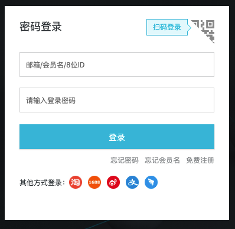
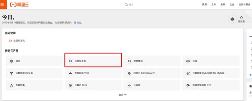
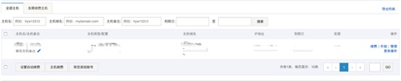
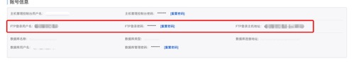
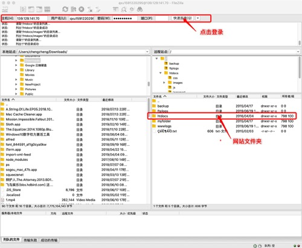
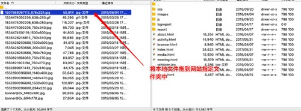
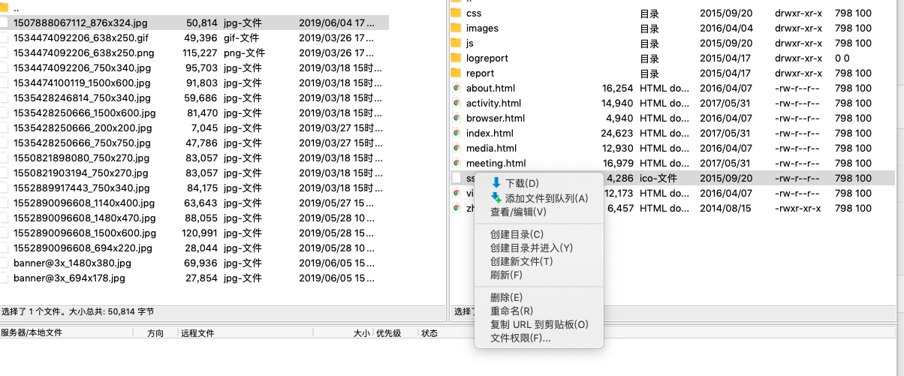
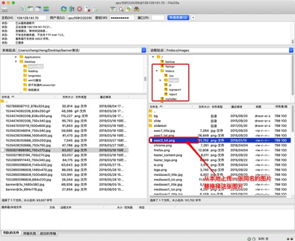

### 阿里云虚拟空间 FTP 登录并更换文件

#### 登录阿里云

- 登录[https://account.aliyun.com/login/login.htm](https://account.aliyun.com/login/login.htm)

进入控制台

进入云虚拟主机

这里能看到网站机器的基本信息

- 获取 FTP 账号信息

按照以下文档获取 FTP 账号和密码

[https://help.aliyun.com/knowledge_detail/36133.html?spm=a2c4g.11186623.2.15.c9445080RQyVl2](https://help.aliyun.com/knowledge_detail/36133.html?spm=a2c4g.11186623.2.15.c9445080RQyVl2)

***FTP 密码可以重置，如果不知道原密码***

### 下载 FTP 客户端

下载地址:

[https://filezilla-project.org/](https://filezilla-project.org/)

选择自己所在的平台现在：

### 登录 FTP客户端

将下图中的FTP登录主机地址，FTP登录用户名，FTP登录密码输入filezilla客户端，登录FTP

登录之后就能看到网站远程文件夹，左边是本地文件夹，右边是远程文件夹

也可以将远程文件下载到本地左边打开的文件夹里

比如需要替换原来网站上的一张图，你先需要找到原来的图片，然后替换掉它

相应的，你可以修改其他文件。

ok，大概就是这些，Happy Coding!
